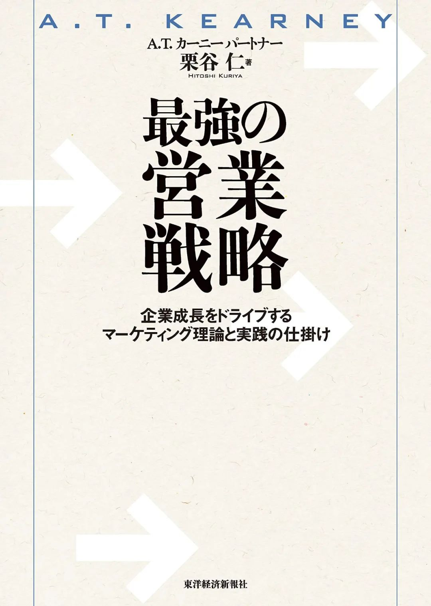

这本书阅读起来有一点难度。我在第一次做SFA（Sales Force Automation）相关的项目时，PM给我推荐了这本书；我在一年目完全没有实务经验、对该领域一无所知的情况下，根本就翻不动这本书。

时过境迁，我绕了一圈又回来做制造业的SFA领域了，于是又把这本书翻出来看了看。现在读，能够理解书中的内容了，然而，可能因为此书的作者是A.T. Kearney出身，读起来有一种“悬浮感”。

我仔细思考了一下，为什么会出现这种“悬浮感”。

虽然咨询是一个为公司出谋划策的职业，客户的counterpart也都是部长等级的人物，但是战略的制定，不仅仅是为了经营层，也是为了能让在现场的第一线员工受到恩惠；尤其是这本书的“营业战略”，营业是一个公司中最前线的冲锋队员，战略的制定，无论是top-down的战略实行还是bottom-up从现场反映上来的feedback，都会对全社产生直接的影响。

书中的内容是从各种项目的经验中提炼出来的理论框架和战略实践总结，非常构造化，也非常涨知识，是一个可以作为参考书反复翻看的高质量“教科书”；不过它的“有用”“有参考价值”可能更多的是对于executives管理层，或者是做营业管理的人，对于我这种底层咨询，或者是在现场前线与客户打交道的营业来说，阅读这本书的意义，可能在于让自己尝试着站在Manager或Partner的高度下尽力理解他们看待问题的视角和视野，并期待这样的知识储备，能有一天在工作中派上用场了。

以下只摘录了书中一小部分。
                    
## 营业活动的流程

1. Door Open
- 最初应对新客户时，营业需要掌握顾客的基本情况，找出客户的痛点和需求，与顾客建立信赖关系，构筑面向客户的自社营业体制；
2. 提案内容讨论
- 营业提供价值的具体化：应对顾客需求的具体提案，自社的竞争优位性讨论，转型障碍的对应；这里需要注意的是，营业在进行提案时，不能仅仅从应对顾客需求出发，收集具有竞争关系的友商的情报并进行价值（商品性能、价格、服务）的比较，在比较之上更加明确有力地向顾客传达自社的价值信息；
3. 提案，方案决定
- 应对顾客需求时，顾客很容易提出一些适应公司独特性的特殊式样要求。
- 然而，并不是所有的自定义需求都能对这家公司有利。比如，在产品设计的阶段，因为其特殊性，会影响其他标准化商品的使用，在商品组配件供应时，也会出现无法大量下单导致成本上升等问题，成本上升必定会影响到商品定价，定价过高导致终端顾客的流失，最终导致公司的利益受损等等。
- 因此，调节顾客自定义需求应对及业界标准化的平衡度非常重要；基于成本的提案设计，也是提案获得成功的关键；

4. 价格决定，Closing
- 在这个阶段，需要设定服务水准和价格的最优化（物流等价值链各个环节的顾客业务分配分担也在考虑范围内），确定顾客收益性，做出具有战略意义的价格提案；
- 同时还要确定顾客转换到他社产品时的阻碍因素及对应施策，在确定这些之后，营业活动才能告一段落Closing；

5. 交付
- 产品的交付需要考虑顾客的地域、配送等对全体成本的影响度；如果顾客的物流成本过高，或配送地区效率低的话，则这家公司一开始就不应该成为营业的目标。同时，如果成本上升，也需要在考虑抵消成本上升带来的影响因素之下进行价格设定。

6. 后续提案
- 下单成功或交付后，营业差不多就要开始以扩大销量为目的的新提案了；
- 在销售活动的同时，将自社的接单预测量作为顾客生产线的参考情报（批量订单的实现），将end user对产品的需求转化为产品开发的参考情报等等，提供各种情报给客户公司各部门，也是营业的工作职能之一。
- 营业倾向于将视野集中在实现自己的营业目标上，然而，把自己定位成自社全社的代理人，实时与客户进行情报的交换，对于构筑客户间长期良好的关系也十分重要。

                     

## 营业课题解决的6个步骤

1. 战略方针的明确化
营业方针确立，市场划分（Segmentation），确定市场客群，明确接近各目标客群的渠道方法，战略决定者的攻略法，价格战略的确立

2. 战略与个别活动的连接
将战略落实到可把握的营业个别活动之中

3. 营业职能定义及活动标准化
将预想的改善后的营业活动内容具象化，业务流程标准化，将客户访问活动等营业活动按优先度整理，并明确各项业务的投入时间量

4. 营业活动效率化
压缩间接业务，并将在营业活动中投入的时间和附加价值最大化

5. 营业体制的确立
各个营业据点的人员配置及体制的明确化，各个大客户的对应体制明确化

6. 营业活动的PDCA方法确立
营业活动全体的PDCA改善方法的建立，个别活动的监视和营业个体的PDCA的确立

                     

## 营业战略方针的明确化

### 4个基本方向性

- 对既存顾客扩大已有商品的占有率
- 
对既存顾客展开cross sell，促进新用途新商品的销量

- 对新顾客拓展已有商品的销量（比如对既存顾客的邻接部门的展开，既存顾客同业界的他社展开等）
  
- 对新顾客进行新用途新商品的销售展开

### 潜在市场推定
- 在进行战略方针决定时，对市场全体、自社、他社的现状及未来趋势的分析至关重要，以这些分析为基础，才能把握未来市场潜力。

- 潜在市场，是指自社的商品能够满足顾客需求，相比他社或者其他替代品有一定竞争优位性，并且转换成自社商品的物理及心理的障碍偏低，同时该市场的预期收益可观。
- 对潜在市场的推定，要以中期的成长规划为主，同时需要考虑包含After Service成本的收益性。

### 营业的市场划分方法
- 从营业活动视角出发的市场划分，主要以营业在业务中理解的顾客基本情报、属性来划分。

- 对营业来说重要的是，不能从表面上理解顾客需求，而是需要在日常的营业活动中以不同的角度认识客户的需求和各个客户需求中的共通点，并从中找出提出这些需求的出发点及根本原因。这样的市场划分才能被称为有效。

### 如何明确顾客需求
大分类可以分为”要求“，”购买行动“及”烦恼“。
- 要求：
    - 把握未满足的要求（Unmet needs）非常重要。
  - 同时除了客户的要求，顾客没有积极地表达出来的”knockout factor“(淘汰因素，不选择自社商品的关键原因)也是需要确认的。

- 购买行动：
  - ”积极地导入新产品“，”回避风险保守购买“等，这些以营业目标为前提的购买行动，也是能够发掘出一定的需求的。

- 烦恼：
  - 如果能够把握到顾客感到最头痛最苦恼的地方，也就是痛点，那么对于建立良好的信赖关系是非常有利的。

                     

## 营业活动效率化

为了让营业在实际具有附加价值的活动上集中更多的时间，将间接业务压缩是必不可少的一个效率化改革任务，而且大部分公司里存在着很多能够大幅削减的间接业务。

在间接业务中，将附加价值低且消耗时间多的的业务整理并分离出来，营业活动的效率化就能一定程度地实现。

### 从营业业务附加价值的角度分类

营业的间接业务可分为附加价值活动、必要业务及低附加价值活动。

附加价值活动需要增加或维持现状，必要业务需要重新评估其必要性并最小化，低附加价值业务则需要废止、最小化或转移成为公司back office部门的业务。

### 企业风土和内部经营课题

日本传统大企业中常常会出现的组织形式是，营业支店拥有完整的组织体制，导致本社和支店出现职能重复，双重管理的课题。

传统的厚重组织形式，及过剩管理，会使汇报及报告书提交等不必要的管理业务增加，降低营业的工作效率。

在服务业上，以重视顾客满足度的名义，过分你花费时间在顾客对应和客服上，也导致了业务流程的冗余，日本企业亟需改善这一点。

### 营业间接业务的整理和效率化

各项业务中，1）职能员工人数配置等的”输入Input“，2）业务处理的”流程“，3）业务的”输出Output“，营业部门及进行营业改革的咨询，需要从这几个观点出发，进行业务构造的分析和整理，在这之上进行业务效率化改善的讨论和施策的检讨。